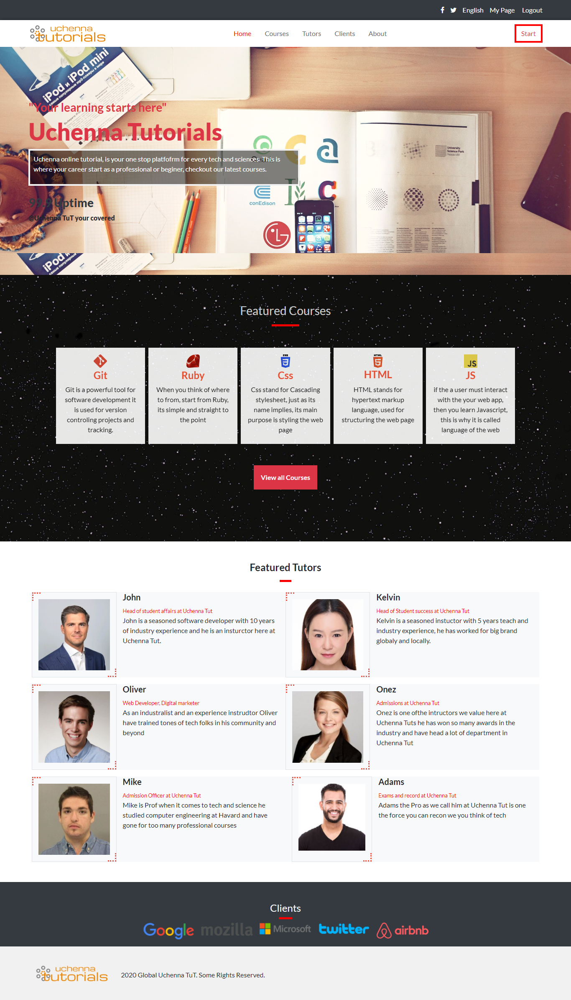

# Uchenna Turorials.

## Definition

This website is an online learning platform that provides user and learners resources for learning and also to the ability to choose and pay for courses online.

# About the project

This project is about designing/cloning of a e-learning platform website

The features of this project are listed below:

1. The website is completely responsive, mobile and screen sizes above 768px.

2. The site contains information for intructors:

- Common information on every page.

  - Header with site navigation links.
  - Footer with logo and copyright information.

- Information on the Homepage.

  - Banner image with information regarding how to use the e-learning platform.
  - Infomation about the e-learning platform.
  - Featured courses.
  - Partners and who supported the program.

- Information on the about us page:

  - Some information about the platform
  - Information regarding how the logo was chosen.
  - Community project.

- Information on the plan page:
  - Options to select plan for basic, intermediate and advance.
  - Options to choose different plan based on the price chosed.

## Built With

- HTML
- CSS
- Javascript

## Live Demo

[Live Demo Link](https://priceless-williams-b54992.netlify.app/)

## Getting Started

**Just clone this repo and open index.html file in your browser then you are good to go.**

**To get a local copy up and running follow these simple example steps.**

**clone the repo.**

## Authors

👤 **Uchenna Anya**

- GitHub: [uchennaanya](https://github.com/uchennaanya)
- Twitter: [@martiinsanya19](https://twitter.com/martinsanya19)
- LinkedIn: [Uchenna Anya](https://www.linkedin.com/in/uchenna-anya/)

## 🤝 Contributing

Contributions, issues, and feature requests are welcome!

## Show your support

Give a ⭐️ if you like this project!

## Acknowledgments

- Thanks to [Cindy Shin](https://www.behance.net/adagio07) for this [marvellous & amazing UI](https://www.behance.net/gallery/29845175/CC-Global-Summit-2015)
- icons used from [iconify](https://iconify.design/)
- Font **lato** used from [google fonts](https://fonts.google.com/)
- Source of featured tutors image and a short bio is [wikiart](https://www.images.google.com)
- Images source in the website is [unsplash](https://unsplash.com/) from authors [Xavier von Erlach](https://unsplash.com/@altumcode?utm_source=unsplash&utm_medium=referral&utm_content=creditCopyText), [Highlight ID](https://unsplash.com/@highlightid), [Pauline Loroy](https://unsplash.com/@paulinel), [Paweł Czerwiński](https://unsplash.com/@pawel_czerwinski)
- Partner section logo source is [pngegg](https://www.pngegg.com/)

## 📝 License

This project is [MIT](./LICENSE) licensed.
